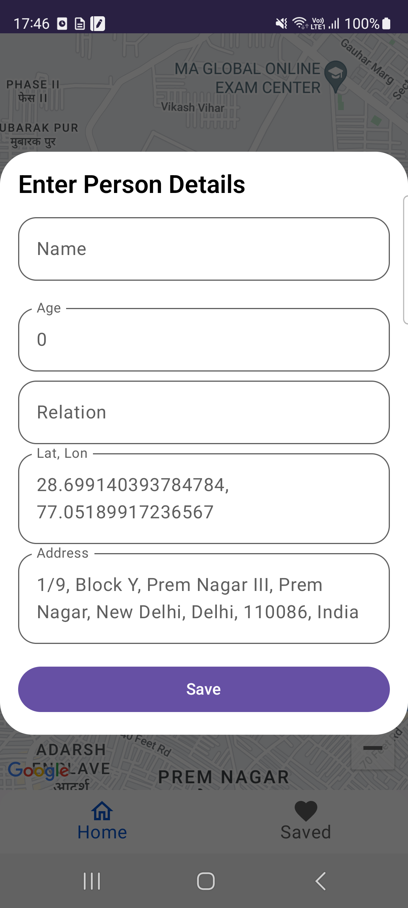

<h1 align="center">
  Google Maps Marker App
</h1>

  
  
  

## Introduction

This project uses [Jetpack Compose](https://developer.android.com/jetpack/compose) technology, in short jetpack Compose is Android’s recommended modern toolkit for building native UI. It simplifies and accelerates UI development on Android. Quickly bring your app to life with less code, powerful tools, and intuitive Kotlin APIs.
To try out this sample app, use the latest stable version of [Android Studio](https://developer.android.com/studio). You can clone this repository or import the project from Android Studio following the steps [here](https://developer.android.com/jetpack/compose/setup#sample).
  
  
## Major Highlights

- **Jetpack Compose** for modern UI
- **Offline caching** with a **single source of truth**
- **MVVM architecture** for a clean and scalable codebase
- **Kotlin** and **Kotlin DSL**
- **Dagger Hilt** for efficient dependency injection.
- **Room DB** for local storage of news articles
- **Coroutines** and **Flow** for asynchronous programming
- **StatFlow** for streamlined state management
- **Navigation** for smooth transitions between screens
- **Google Maps Compose** for save locations

## Feature implemented:
-  Google Maps Marker App
- Get your live location
- Drop marker any where on map and save maker with name, address, relation, age
- View saved location and manage, delete
  
# Preview App
| Home Screen  | Details Pop-up | Saved Location Screen |
| ------------- | ------------- | ------------- |
|   |  |  | 

| Delete Pop-up | Full Video |
| ------------- | ------------- | 
|   | <video src="https://github.com/roshansharma824/Google-Maps-Marker-App/assets/85518522/52fdfa25-cc6a-4111-89a1-c2da1bb29571" height=500 width=250/> |
